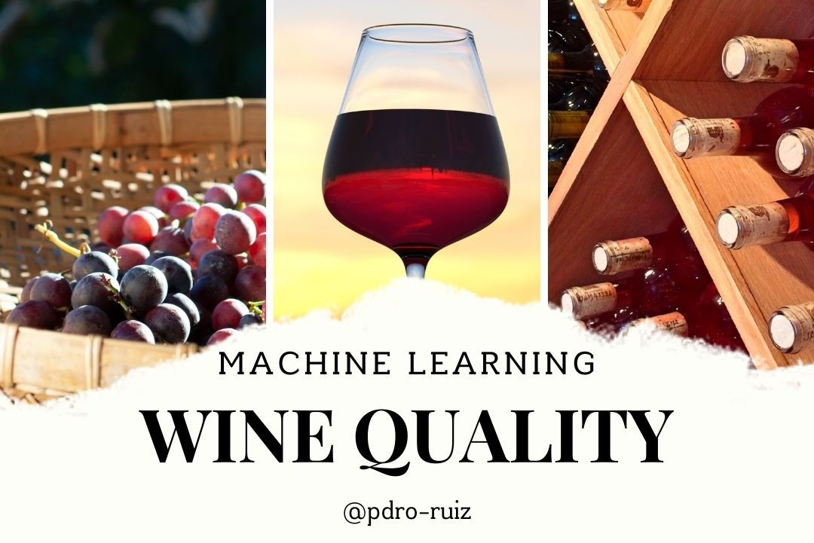

# Wine Quality Prediction Through Machine Learning  

## 📖 Descripción  

Este proyecto aborda el análisis y predicción de la calidad del vino utilizando modelos de Machine Learning. El dataset empleado es ampliamente conocido en la comunidad de Data Science y contiene características químicas de diferentes tipos de vino (blanco y tinto), junto con una calificación de calidad.  

### **Objetivo del Proyecto**  
Desarrollar un modelo de Machine Learning capaz de predecir la calidad del vino basándose en sus características químicas, lo cual podría ser de gran utilidad en la industria vinícola para optimizar la producción y calidad de los productos.  

  

  
---

## 🚀 Flujo de Trabajo  

1. **Exploración inicial de los datos:**  
   - Visualización de las características del dataset y su relación con la variable objetivo (`quality`).  
   - Identificación de valores nulos y patrones en los datos.  

2. **Preparación de los datos:**  
   - Codificación de variables categóricas utilizando `LabelEncoder`.  
   - Imputación de valores faltantes mediante el método k-NN (`KNNImputer`).  
   - Normalización de las características con `MinMaxScaler`.  

3. **Modelado:**  
   - Entrenamiento de los modelos:  
     - **Logistic Regression:** Modelo base para clasificación binaria.  
     - **XGBoost Classifier:** Algoritmo eficiente basado en boosting.  
     - **Support Vector Classifier (SVC):** Modelo robusto para espacios de alta dimensionalidad.  
   - Evaluación de los modelos mediante métricas como AUC-ROC.  

4. **Análisis de resultados:**  
   - Comparación de las precisiones de los modelos.  
   - Discusión sobre posibles mejoras y limitaciones.  

---

## 🛠 Tecnologías y Librerías  

- **Python:** Lenguaje principal para la implementación.  
- **Librerías principales:**  
  - Manipulación de datos: `numpy`, `pandas`.  
  - Visualización: `matplotlib`, `seaborn`.  
  - Modelado: `sklearn`, `xgboost`.  

---

## 📊 Análisis de Datos  

### **Observaciones iniciales:**  
1. La mayoría de los vinos tienen una calidad entre 5 y 6, lo que indica una inclinación hacia vinos de calidad media.  
2. Los vinos blancos predominan en el dataset.  
3. Algunas características como `alcohol` tienen una correlación positiva moderada con la calidad, mientras que otras, como `volatile acidity`, tienen una correlación negativa.  

### **Visualizaciones Clave:**  

1. **Distribución de la calidad:**  
   La mayoría de los vinos se concentran en puntuaciones de calidad de 5 y 6.  

2. **Relación entre `alcohol` y `quality`:**  
   Los vinos con mayor contenido alcohólico tienden a obtener calificaciones más altas.  

3. **Relación entre `type` y `quality`:**  
   Los vinos blancos suelen obtener mejores calificaciones en comparación con los vinos tintos.  

---

## 🧠 Modelos de Machine Learning  

| Modelo                     | Precisión en Entrenamiento | Precisión en Validación |  
|----------------------------|----------------------------|--------------------------|  
| Logistic Regression        | 70.27%                    | 70.12%                  |  
| XGBoost Classifier         | 98.13%                    | 81.32%                  |  
| Support Vector Classifier  | 72.04%                    | 71.12%                  |  

### **Resultados Clave:**  
- **XGBoost Classifier** mostró la mayor precisión en validación (81.32%), aunque presenta riesgo de sobreajuste.  
- **Logistic Regression** y **SVC** tienen resultados similares, con buen equilibrio entre entrenamiento y validación, pero menor precisión.  

---

## 🏁 Conclusiones  

1. **Insights del Análisis:**  
   - Características como `alcohol`, `volatile acidity` y `chlorides` son determinantes en la calidad del vino.  
   - Los vinos blancos tienden a obtener mejores calificaciones que los tintos.  

2. **Evaluación de Modelos:**  
   - XGBoost se destacó como el mejor modelo para este problema, aunque con potencial sobreajuste.  
   - Logistic Regression y SVC proporcionaron un punto de partida robusto con resultados consistentes.  

3. **Mejoras Futuras:**  
   - Implementar modelos de aprendizaje profundo para capturar relaciones más complejas.  
   - Ampliar la exploración del dataset con técnicas avanzadas de ingeniería de características.  

---

## 💬 Agradecimientos  

Gracias por tomarte el tiempo de explorar este análisis. Si este proyecto te pareció interesante o útil, no olvides dejar un **UPVOTE** y explorar otros proyectos en mi portafolio.  

¡Hasta la próxima! 👋  
